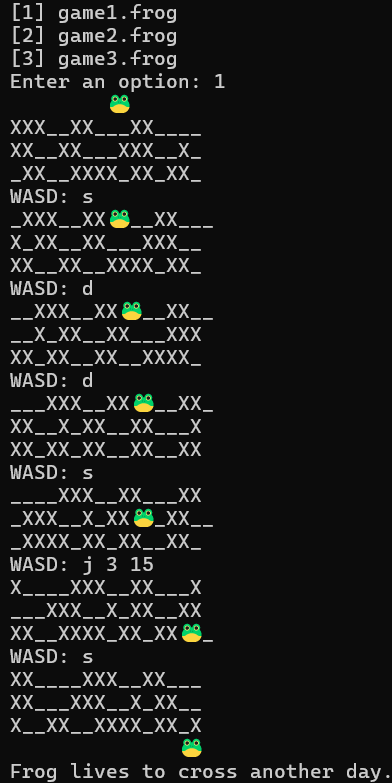
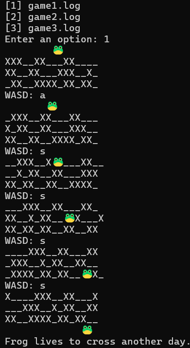

# Project 2

Objective
- To avoid the vehicles or river and reach the bottom safely

🎮 Game Description
- This is a text-based, ASCII-style version of Frogger, where your mission is to navigate the frog (🐸) safely across a hazardous road and river. You'll dodge obstacles, hop across platforms, and survive the challenge — all inside your terminal!

- Each game map is loaded from a *.frog* text file, and the frog is controlled with keyboard inputs in real-time. Make one wrong move, and the frog sees an end. Make it across, and the game reminds you: "Frog lives to cross another day."

✅ Requirements
- Python: 3.x
- Module: "os"

📝 Steps to Run
- on the terminal: `python frogger.py`
- Choose a level file when prompted
- 🎮 Controls
    - Use WASD keys to move the frog
    - j [row] [col] — Jump the frog to the specific column but only skip 1 row

## Frogger

🕹️ Gameplay Notes
- X : vehicles
- _ : safe space
- 🐸 : main character

Example run for `frogger.py`\

## Logger

🕹️ Gameplay Notes
- X : log (safe space)
- _ : river
- 🐸 : main character

Example run for `logger.py`\
