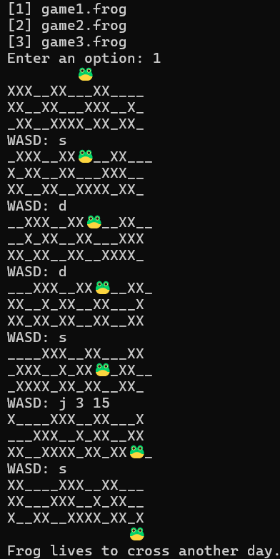
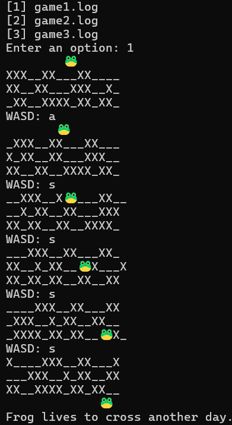

# Frogger

## Objective
- To avoid the vehicles or river and reach the bottom safely.

---

## Game Overview
- This is a text-based arcade game written in Python that includes two gameplay modes: **Frogger** and **Logger**. Both games challenge the player to guide the frog safely across dangerous environments using movement, timing, and strategy.

- This project recreates classic arcade mechanics inside the terminal using ASCII-style maps, keyboard controls, and file-based level design.

- It demonstrates programming concepts such as:
  - File input/output
  - Game loops
  - Conditional logic
  - Real-time movement
  - Grid-based maps
  - User input handling

---

## Purpose / Problem Being Solved
- The purpose of this project was to build an interactive Python game while practicing logic, map traversal, and user-controlled movement systems.

- The project solves the challenge of creating a playable terminal game that can:
  - Load maps from external files
  - Accept keyboard controls
  - Detect hazards and safe zones
  - Move the player across the board
  - Create win/lose conditions
  - Support multiple game variations

---

# 🎮 Game Description
- This is a text-based, ASCII-style version of Frogger, where your mission is to navigate the frog (🐸) safely across a hazardous road and river. You'll dodge obstacles, hop across platforms, and survive the challenge — all inside your terminal!

- Each game map is loaded from a *.frog* text file, and the frog is controlled with keyboard inputs in real-time. Make one wrong move, and the frog sees an end. Make it across, and the game reminds you: **"Frog lives to cross another day."**

---

# ✅ Requirements
- Python 3.x
- Module: `os`

---

# 🛠️ Technologies Used
- Python
- Terminal / Command Line
- Text File Maps (`.frog`)
- ASCII Graphics
- `os` Module

---

# 📝 Steps to Run

## 1. Clone the Repository
```bash id="x5ltop"
git clone https://github.com/Sakar-Ojha/Frogger-Logger.git
cd Frogger-Logger
```

## 2. Run the Game
```bash id="9f1pkv"
python frogger.py
```

## 3. Choose a Level/Map File
- Select a `.frog` map file when prompted.

---

# 🎮 Controls
- **W** = Move Up  
- **A** = Move Left  
- **S** = Move Down  
- **D** = Move Right  
- **j [row] [col]** = Jump the frog to a specific column while skipping only 1 row

---

# ✨ Key Features / Functionality
- Two game modes: Frogger and Logger
- Real-time keyboard movement
- Map loading from `.frog` files
- Hazard detection
- Win and lose conditions
- Jump command support
- Terminal-based graphics
- Replayable level system

---

# 🐸 Frogger

## 🕹️ Gameplay Notes
- **X** = Vehicles / Obstacles  
- **_** = Safe Space  
- **🐸** = Main Character  

### Goal
- Avoid moving vehicles and safely reach the bottom of the map.

### Example Run for `frogger.py`


---

# 🌊 Logger

## 🕹️ Gameplay Notes
- **X** = Log (Safe Platform)  
- **_** = River / Danger  
- **🐸** = Main Character  

### Goal
- Stay on logs, avoid the river, and safely cross the map.

### Example Run for `logger.py`


---

# 👨‍💻 My Role / Contribution
- I designed and implemented the game logic for both Frogger and Logger modes.

My contributions included:
- Handling player movement
- Building map traversal logic
- Loading levels from files
- Creating win/lose conditions
- Implementing jump commands
- Testing gameplay behavior
- Debugging movement and collision logic

---

# 📚 Reflection / Challenges / Lessons Learned
- One of the biggest challenges in this project was managing movement across a changing grid while correctly detecting hazards and valid spaces.

- Through this project, I learned:
  - How to structure game loops in Python
  - How to load and use external level files
  - How to manage coordinates on a grid
  - How to debug movement systems
  - How to turn logic into a playable game

- This project improved my confidence in building larger interactive Python programs.

---

# 🚀 Future Improvements
- Add score tracking
- Add multiple difficulty levels
- Improve animation timing
- Add sound effects
- Add colored terminal graphics
- Create GUI version with `pygame`

---
